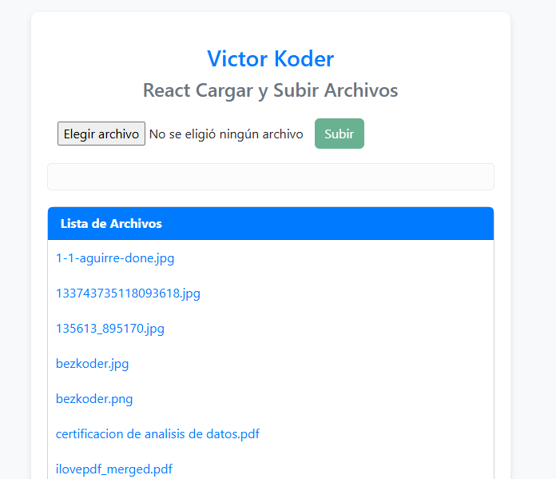

# Sistema de Gestión de Archivos Fullstack


Aplicación fullstack para subir, gestionar y descargar archivos con autenticación JWT.

 <!-- Reemplazar con imagen real luego -->

## Características Principales
- **Frontend**: React con componentes para subida de archivos
- **Backend**: Node.js + Express con almacenamiento local
- **Gestión de Archivos**: Subida, listado y descarga

## Estructura del Proyecto
```bash
project/
├── client/ # Frontend React
├── public/
│ ├── src/
│ │ ├── components/ # Componentes React
│ │ │   └──uploadFilesComponent.js
│ │ ├── services/ # Servicios API
│ │ │   └──uploadFilesService.js
│ │ ├──App.css
│ │ ├──App.js
│ │ ├──http-common.js
│ │ ├──index.css
│ │ ├──idex.js
│ ├──.env
│ ├──package.json
│ │ └── ... # Otros archivos React
├── server/ # Backend Node.js
│ ├── resources # imagenes gestion
│ ├──src
│ │  ├── controller/ # Lógica de negocio
│ │  │  ├── fileController.js
│ │  ├── middleware/ # Middlewares
│ │  │  ├──upload.js
│ │  ├── routes/ # Definición de rutas
│ │  │  ├──index.js
│ │  ├──package.json
│ │  ├──package-lock.json
│ │  └── server.js
```
## Tecnologías Utilizadas

### Frontend
   
 

### Backend
   
 

### Seguridad
 

### Herramientas


## Configuración Inicial

### Requisitos
- Node.js v16+
- npm v8+
- Git

### Instalación

1. Clonar el repositorio:
```bash
git clone https://github.com/190799-vargas/Carga_y_descarga_de_archivos_React_Axios_Boostrap_Node.js_Express
cd Carga_y_descarga_de_archivos_React_Axios_Boostrap_Node.js_Express
```

## Configurar backend:
```bash
cd server
npm install
```
## Configurar frontend:
```bash
cd ../client
npm install
cp .env.example .env
# Editar .env con tus valores
```
## Ejecución
```bash
# Backend (puerto 8080)
cd server
node server.js

# Frontend (puerto 8081)
cd ../client
yarn start
```

## Uso del Sistema
### Subir archivos:
- Seleccionar archivo con el botón "Seleccionar"
- Click en "Subir" para enviar al servidor
- Barra de progreso muestra estado de subida

### Ver archivos subidos:
- Listado automático en la sección "Lista de Archivos"
- Click en nombre para descargar

## Configuración Avanzada
Variables de Entorno (.env)
### Backend:
```bash
PORT=8080
UPLOAD_FOLDER=./uploads
```
### Frontend:
```bash
REACT_APP_API_URL=http://localhost:8080
```

## Personalización
- Cambiar tamaño máximo de archivo en server/middleware/J5_upload.js
- Modificar rutas en server/routes/index.js
- Personalizar interfaz en client/src/components/UploadFilesComponent.js

## Contribución
- Haz fork del proyecto
- Crea tu rama (git checkout -b feature/nueva-funcionalidad)
- Haz commit de tus cambios (git commit -am 'Añade nueva funcionalidad')
- Haz push a la rama (git push origin feature/nueva-funcionalidad)
- Abre un Pull Request

## Licencia
MIT © Victor Alfonso Cargas Diaz


